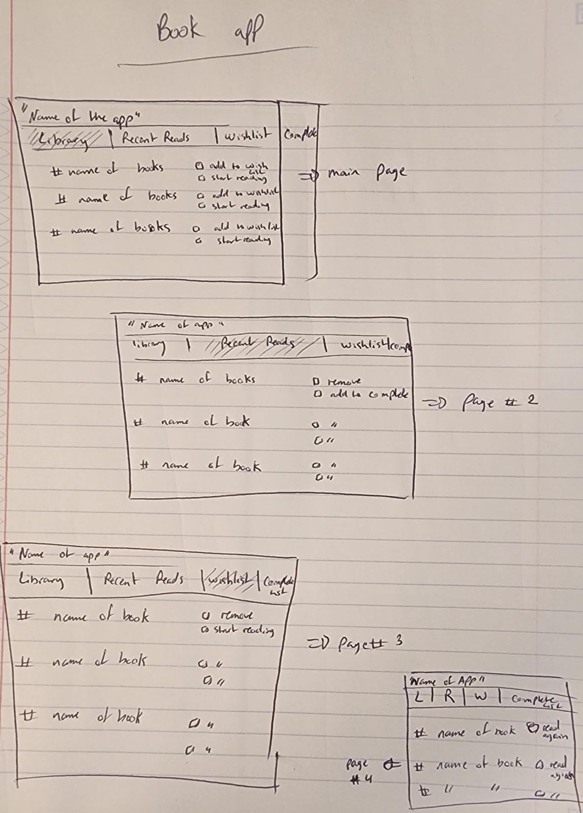

# Description:
Bookshelf  is a comprehensive book app designed to enhance your reading experience and keep your literary adventures organized. It offers a range of features to help you manage your personal library, keep track of recent reads, create wishlists, and maintain a complete list of all the books you've encountered.

# Key Features:

1) Library: Bookshelf Plus provides a virtual library where you can catalog and manage your entire book collection. You can add books manually by entering their details or click the add button found next to a book while   to quickly add books to your wishlist. Each book entry includes information such as title, author, genre, cover image, publication date, and a brief description.

2) Recent Reads: This section allows you to keep track of the books you've recently read. You can mark a book as "complete", and move it to your commplete list, or remove it if you lost interest.

3) Wishlist: Bookshelf Plus lets you create a wishlist of books you want to read in the future. You can browse through the app's extensive database, search for specific titles or authors, and add them to your wishlist with a single tap.

4) Complete List: This section serves as a comprehensive archive of all the books you've read.

Bookshelf Plus aims to be the ultimate companion for book lovers, offering a seamless and organized reading experience with features tailored to your preferences. Whether you're an avid reader, a book collector, or someone who enjoys discovering new titles, Bookshelf Plus is designed to enhance your literary journey and make your reading life more enjoyable.
